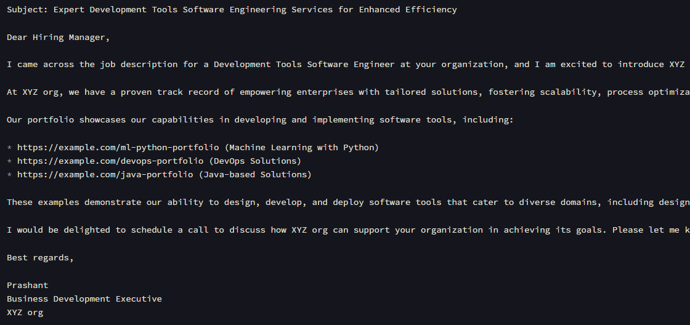

# Cold Email Generator

An AI-powered tool that scrapes job postings from career pages and generates personalized cold emails tailored to potential clients. Built using LLama, LangChain, Groq Cloud, and ChromaDB, this system intelligently extracts job details, matches them with relevant projects from a portfolio, and crafts persuasive emails to maximize outreach effectiveness.

# Features

Scrapes job postings from a given URL.

Extracts job roles, skills, and descriptions using LLama-3.3-70B and LangChain.

Matches job requirements with relevant portfolio links stored in ChromaDB.

Generates a personalized cold email tailored to the job posting.

Interactive Streamlit UI for user-friendly input and email generation.

# Tech Stack

LLM & AI: LLama-3.3-70B (Groq Cloud), LangChain

Web Scraping: LangChain’s WebBaseLoader

Vector Database: ChromaDB

Web Framework: Streamlit
